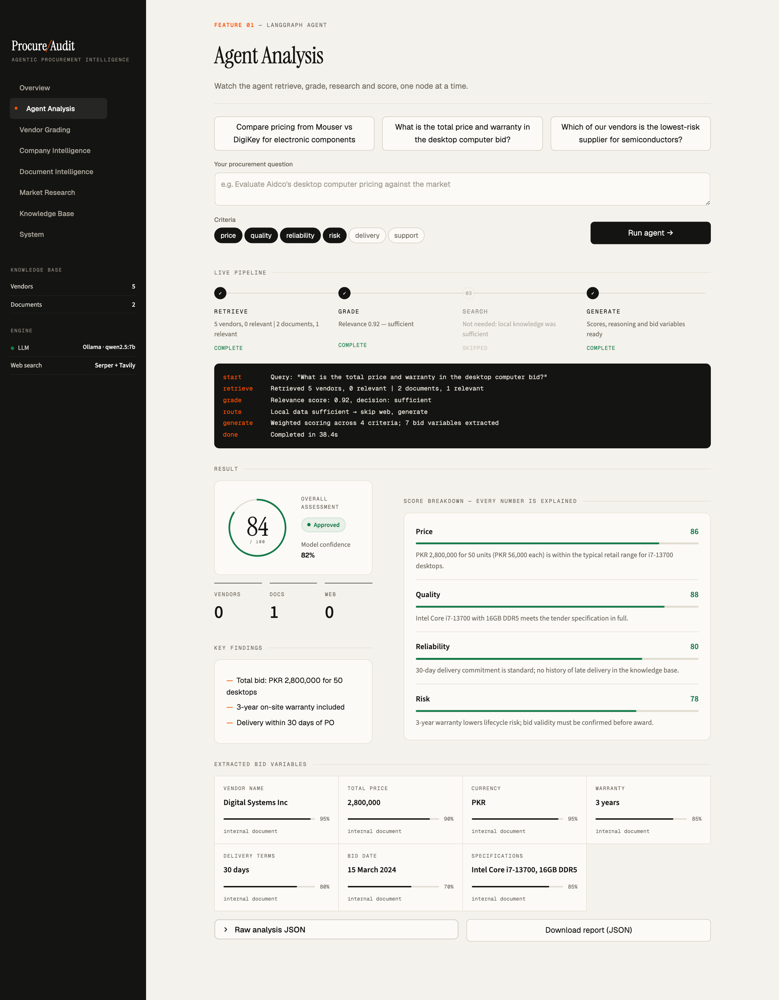
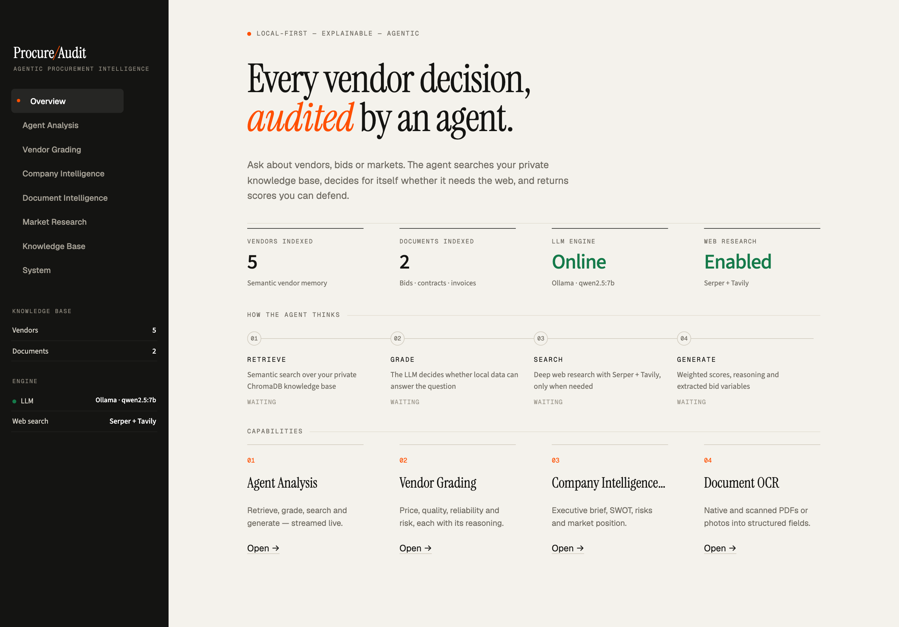
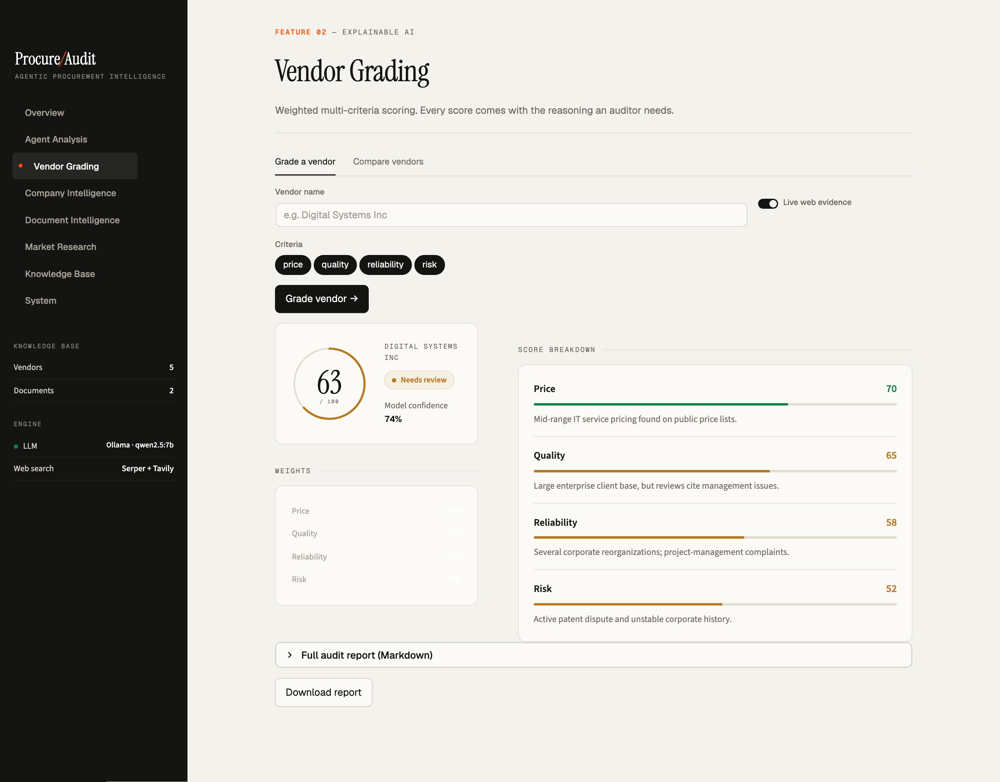
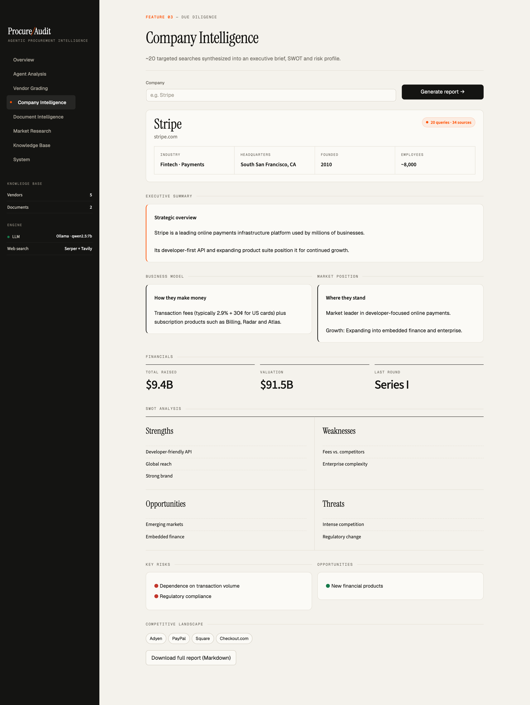
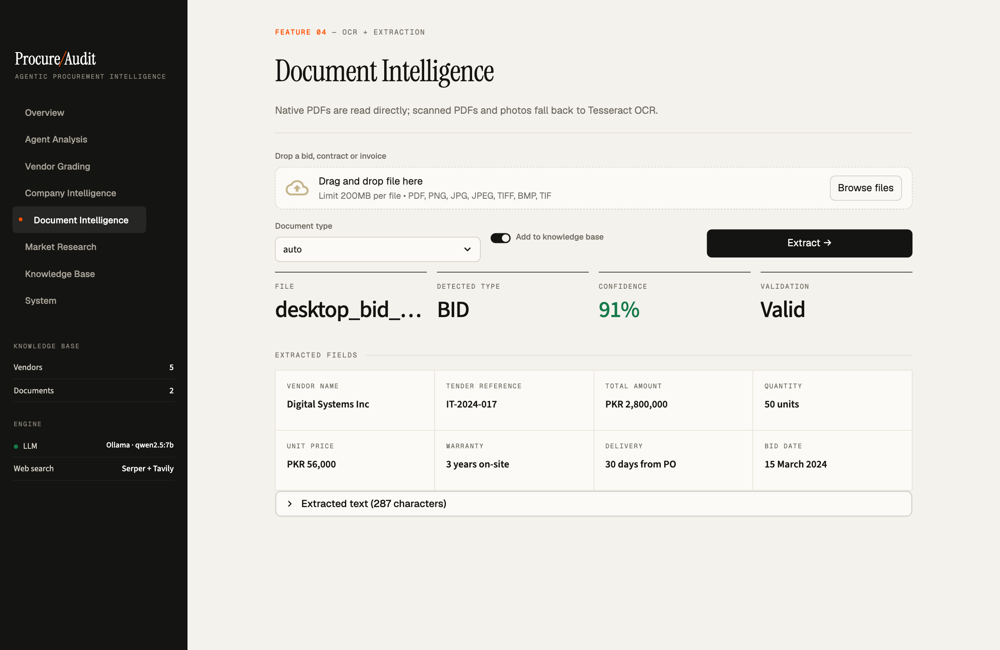
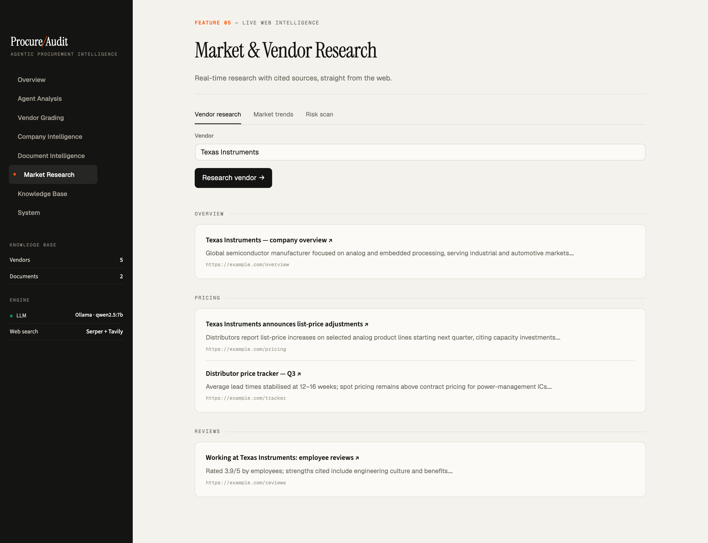
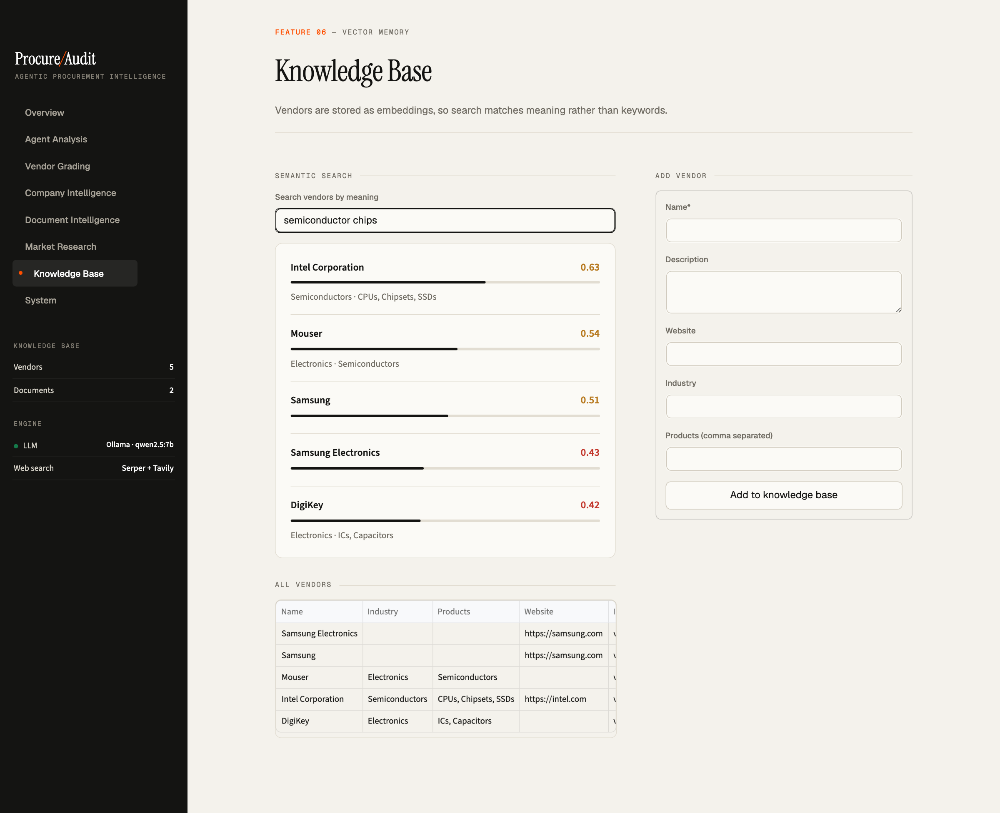
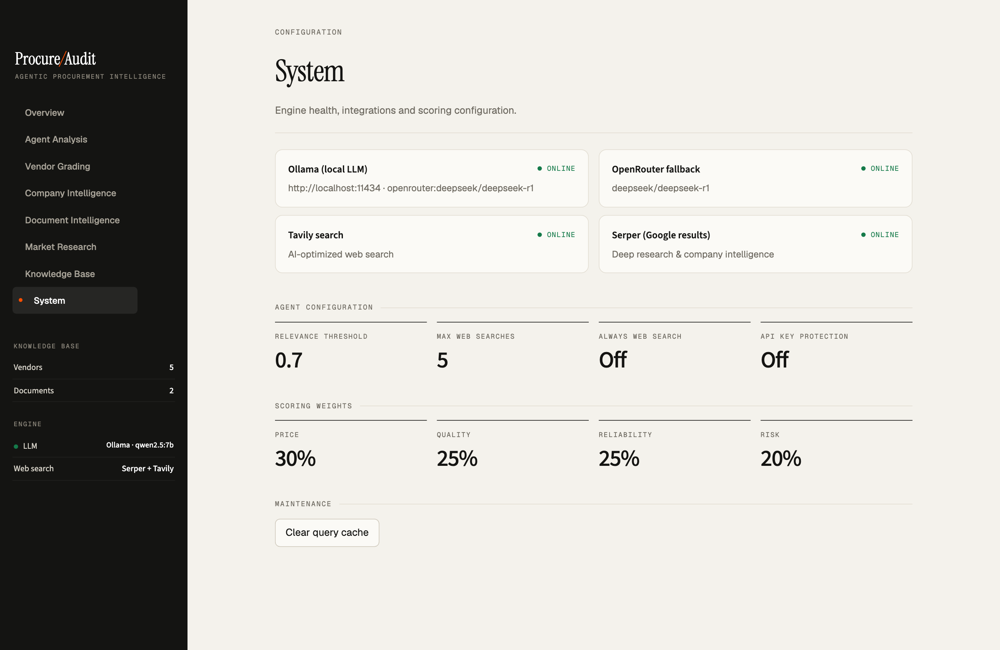

# 🏭 Agentic Procure-Audit AI

> **AI-Powered Procurement Intelligence & Bid Analysis Platform**  
> Local LLM • Document OCR • Web Research • Structured Extraction

[](https://python.org)
[](https://langchain.com)
[](LICENSE)
[](https://github.com/MrAliHasan/Agentic-Procure-Audit-AI/actions/workflows/ci.yml)



<p align="center"><i>The agent grades its own knowledge base, skips the web when it doesn't need it, and explains every score.</i></p>

```bash
pip install -e .          # install
cp .env.example .env      # add your API keys
soi ui                    # open the dashboard at http://localhost:8501
```

---

## 🎯 The Problem

> Procurement decisions are only as good as the documents, vendor data and market research behind them — and most of that work is still manual.

Procurement teams face critical challenges:

| Challenge | Impact |
|-----------|--------|
| **📊 Information Overload** | Vendors, pricing, invoices, bids scattered across PDFs, emails, websites |
| **⏱️ Manual Analysis** | Analysts lose hours to repetitive document review and vendor research |
| **🔒 Data Privacy Risks** | Sensitive contract data exposed when using cloud AI services |
| **📉 Slow Decisions** | Days to analyze bids that should take minutes |
| **🔍 Incomplete Research** | Missing market intelligence leads to overpaying vendors |
| **📄 Scanned Documents** | Critical bid data buried in scanned PDFs that are impossible to search |

---

## ✨ The Solution

An **autonomous AI agent** that transforms procurement intelligence:

```
Your Query → AI Agent → Structured Analysis + Recommendations
           ↓
┌─────────────────────────────────────────────────────────────┐
│  1. Searches your private knowledge base (contracts, bids)  │
│  2. Grades relevance with LLM reasoning                     │
│  3. Supplements with web research if needed                 │
│  4. Extracts structured data (prices, dates, vendors)       │
│  5. Generates actionable recommendations                    │
└─────────────────────────────────────────────────────────────┘
```

### Why This System Stands Out

| Feature | Benefit |
|---------|---------|
| **🔐 Local-First AI** | Runs on Ollama so documents stay on your servers (optional OpenRouter fallback for prompts) |
| **📄 Scanned Document OCR** | Extracts text from scanned PDFs & images that other tools can't read |
| **🤖 Agentic Workflow** | Autonomously decides when to search web vs use local data |
| **📊 Structured Extraction** | Automatically pulls vendor, price, dates into JSON format |
| **💡 Explainable AI** | Full reasoning chain for every decision - not a black box |
| **🌐 Multi-Source Intelligence** | Combines internal docs + web search + real-time pricing |

### Key Benefits

| Goal | How |
|------|-----|
| **Faster vendor analysis** | One command replaces manual searching, reading and scoring |
| **Better vendor selection** | Weighted, explainable scores backed by cited evidence |
| **Fewer data-entry errors** | Prices, dates and terms extracted into structured JSON |
| **Data privacy** | Vector store and local LLM run on your own machine |

---

## 🖥️ Dashboard

A web dashboard (`soi ui`) for every feature, including a live view of the agent's decisions as it runs.



### Agent Analysis — watch the agent decide
The pipeline streams node by node. Here the grader judged the local bid document sufficient, so the agent **skipped web search** and went straight to scoring and bid extraction.


| Vendor Grading | Company Intelligence |
|---|---|
|  |  |
| Weighted, explainable scores for price, quality, reliability and risk | Executive brief, financials, SWOT, risks and competitors |

| Document Intelligence | Market Research |
|---|---|
|  |  |
| Native PDFs, scanned PDFs and photos into structured fields | Live vendor, market and risk research with cited sources |

| Knowledge Base | System |
|---|---|
|  |  |
| Semantic vendor search by meaning, not keywords | Engine health, integrations and scoring weights |

> Screenshots show sample data.

---

## 🚀 Features

### 📄 Document Intelligence

**Extract text from documents that are impossible to search manually:**

| Feature | Description |
|---------|-------------|
| **Scanned PDF OCR** | Reads scanned/photographed documents using Tesseract OCR |
| **Native PDF Extraction** | Fast text extraction from digital PDFs |
| **Image Support** | PNG, JPG, JPEG, TIFF, BMP - any document format |
| **Confidence Scoring** | Know how reliable the OCR extraction is |
| **Multi-Language** | English, German, French, and 100+ languages |
| **Table Extraction** | Parse complex tables from bid documents |

**The Problem It Solves:**
> Most procurement documents are scanned - they're just images inside PDFs. Regular search can't find them. This system uses OCR to make them searchable and analyzable.

```bash
# Add scanned document to knowledge base
soi docs add ./scanned_contract.pdf -t contract -d "Supplier agreement 2025"

# Process and extract fields from invoice
soi docs process ./invoice.pdf -t invoice

# The system automatically:
# 1. Detects if PDF is scanned or digital
# 2. Uses OCR with optimized settings for scanned docs
# 3. Extracts and stores text for future queries
```

---

### 🔍 Vendor Analysis & Scoring

| Feature | Description |
|---------|-------------|
| **Multi-Criteria Scoring** | Price, Quality, Reliability, Risk (0-100) |
| **Explainable Reasoning** | Chain-of-thought explanations for each score |
| **Recommendations** | APPROVED / REVIEW / REJECTED with confidence |
| **Vendor Comparison** | Side-by-side analysis of multiple vendors |
| **Historical Tracking** | Build vendor profiles over time |

```bash
# Analyze a vendor query
soi analyze "Compare pricing from Aidco vs Shirazi for desktop computers" -v

# Output includes:
# - Overall Score: 85
# - Breakdown: {price: 92, quality: 85, reliability: 90, risk: 88}
# - Recommendation: APPROVED
# - Confidence: 0.9
# - Full reasoning chain
```

---

### 📊 Structured Bid Variable Extraction

**Automatically extracts key fields from bid/tender documents:**

| Field | Description | Confidence |
|-------|-------------|------------|
| `vendor_name` | Winning or relevant vendor | 85-95% |
| `total_price` | Bid amount (numeric) | 95% |
| `currency` | PKR, USD, EUR, GBP auto-detected | 95% |
| `bid_date` | Date of bid/tender | 90% |
| `valid_until` | Bid validity period | 80% |
| `specifications` | Technical specs | 70% |
| `delivery_terms` | Delivery period/terms | 80% |
| `warranty` | Warranty terms | 80% |
| `tender_reference` | Reference number | 85% |

**Query-Aware Extraction**: Vendors mentioned in your query get priority matching (95% confidence).

**The Problem It Solves:**
> Manually copying vendor names, prices, and dates from bid documents is tedious and error-prone. This system extracts them automatically into a structured JSON format ready for spreadsheets or databases.

---

### 🌐 Intelligent Web Research

| Feature | Description |
|---------|-------------|
| **Multi-Engine Search** | Tavily + Serper + Google fallback |
| **Deep Scraping** | Extracts full page content, not just snippets |
| **Document Discovery** | Finds and downloads relevant PDFs from web |
| **Real-Time Pricing** | Scrapes actual prices from distributor websites |
| **LLM Price Extraction** | Uses AI to extract prices from any content |
| **Source Attribution** | Know where every piece of data came from |

**The Problem It Solves:**
> When analyzing a vendor bid, you need market prices for comparison. This system automatically searches the web, downloads relevant documents, and extracts real pricing data.

```bash
# Automatic web research when local data insufficient
soi analyze "Market price for HP ProDesk 400 G7 desktop" -v

# System automatically:
# 1. Checks local knowledge base
# 2. Searches Tavily/Serper for pricing
# 3. Scrapes distributor pages
# 4. Extracts real prices with LLM
# 5. Generates analysis with sources
```

---

### 💾 Private Knowledge Base (ChromaDB)

| Feature | Description |
|---------|-------------|
| **Vector Storage** | Semantic search across all your documents |
| **Document Collection** | Store contracts, bids, invoices |
| **Vendor Database** | Track vendor profiles and history |
| **Persistent** | Data survives restarts |
| **100% Local** | Never syncs to cloud - air-gapped if needed |

**The Problem It Solves:**
> Your confidential contracts and vendor data shouldn't be uploaded to cloud AI services. This system keeps everything on your local machine.

```bash
# Add documents
soi docs add ./bid_evaluation.pdf -t bid

# List stored documents
soi docs list

# Search local knowledge base
soi search "contract renewal terms" --local-only
```

### 🎯 Lead Generation & Scraping

**AI-powered lead scraping with email extraction:**

| Feature | Description |
|---------|-------------|
| **Smart Lead Search** | LLM generates diverse search queries for maximum coverage |
| **LinkedIn Scraping** | Extract profiles with Gmail addresses |
| **Email Extraction** | Automatically finds emails from web pages |
| **Pagination** | Get 100+ leads per search with auto-pagination |
| **Query Rotation** | Auto-generates new queries if targets not met |

```bash
# AI-powered lead search with Groq LLM
soi leads smart "dentists in Miami" -n 100

# LinkedIn profile scraping with Gmail extraction
soi leads linkedin "software engineers San Francisco" -n 100

# Basic lead scraping
soi leads scrape "coffee shops Austin" -n 50 -o leads.json
```

**Output includes:** Name, Email, Phone, Address, Website (or LinkedIn URL)

---

### 🖥️ CLI Interface

Beautiful terminal output with tables, colors, and progress indicators.

> **📖 See [CLI_COMMANDS.md](CLI_COMMANDS.md) for complete command reference.**

| Command | Description |
|---------|-------------|
| `soi analyze "query" -v -s` | Analyze with verbose output, save report |
| `soi research company "name"` | **Deep company research** with executives, funding, market data |
| `soi leads smart "query" -n 100` | AI-powered lead search with LLM |
| `soi leads linkedin "query"` | LinkedIn profile scraping with Gmail |
| `soi leads scrape "query"` | Basic lead scraping |
| `soi docs add <file>` | Add document to knowledge base |
| `soi docs list` | List all stored documents |
| `soi vendors add "name"` | Add vendor to database |
| `soi status` | Check system health (LLM, ChromaDB, APIs) |
| `soi ui` | Launch Streamlit dashboard |
| `soi serve` | Start FastAPI server |

---

### 🌐 REST API

```bash
# Start API server
soi serve
# or
uvicorn src.api.server:app --host 0.0.0.0 --port 8000
```

| Endpoint | Method | Description |
|----------|--------|-------------|
| `/api/v1/analyze` | POST | Analyze query with AI |
| `/api/v1/documents/process` | POST | Process document (OCR + extraction) |
| `/api/v1/vendors` | GET/POST | Manage vendors |
| `/health` | GET | Health check |

---

### 📊 Streamlit Dashboard

Interactive web interface for non-technical users:

```bash
soi ui
# or
streamlit run dashboard/app.py
```

| View | Features |
|------|----------|
| **Query Analysis** | Interactive analysis with visualizations |
| **Document Upload** | Drag & drop document processing |
| **Vendor Explorer** | Browse and compare vendors |
| **Report History** | View saved analysis reports |

---

## 🏗️ Architecture

### The Retrieve-Grade-Search-Generate Loop

```
┌────────────────────────────────────────────────────────────┐
│                   AGENTIC PROCURE-AUDIT AI                  │
├────────────────────────────────────────────────────────────┤
│                                                             │
│   ┌─────────────┐    ┌─────────────┐    ┌─────────────┐    │
│   │  RETRIEVE   │ ─▶ │    GRADE    │ ─▶ │  GENERATE   │    │
│   │             │    │             │    │             │    │
│   │ • ChromaDB  │    │ • Relevance │    │ • Analysis  │    │
│   │ • Documents │    │ • Scoring   │    │ • Extract   │    │
│   │ • Vendors   │    │ • Threshold │    │ • Report    │    │
│   └─────────────┘    └──────┬──────┘    └─────────────┘    │
│                             │                               │
│                    Low Score│(relevance < 0.4)              │
│                             ▼                               │
│                      ┌─────────────┐                        │
│                      │ WEB SEARCH  │                        │
│                      │             │                        │
│                      │ • Tavily    │ ─┐                     │
│                      │ • Serper    │  │                     │
│                      │ • Scraping  │  │                     │
│                      │ • Downloads │  │                     │
│                      └─────────────┘  │                     │
│                             │         │                     │
│                             ▼         │                     │
│                      ┌─────────────┐  │                     │
│                      │   PRICING   │◀─┘                     │
│                      │ EXTRACTION  │                        │
│                      │             │                        │
│                      │ • LLM Parse │                        │
│                      │ • Regex     │                        │
│                      │ • Tables    │                        │
│                      └─────────────┘                        │
│                                                             │
│   ╔═══════════════════════════════════════════════════════╗│
│   ║              LOCAL AI INFRASTRUCTURE                   ║│
│   ║  DeepSeek-R1 (Ollama) │ ChromaDB │ Tesseract OCR      ║│
│   ╚═══════════════════════════════════════════════════════╝│
│                                                             │
└────────────────────────────────────────────────────────────┘
```

### How It Works

1. **RETRIEVE**: Search your private ChromaDB for relevant vendors and documents
2. **GRADE**: LLM evaluates if retrieved context is sufficient
3. **SEARCH**: If grade fails, autonomously search web for missing information
4. **EXTRACT**: Pull structured bid variables (vendor, price, currency, dates)
5. **GENERATE**: Produce final analysis with full reasoning and sources

---

## 🛠️ Technology Stack

| Component | Technology | Purpose |
|-----------|------------|---------|
| **LLM** | DeepSeek-R1 via Ollama | Local reasoning, analysis |
| **Orchestration** | LangGraph | Agentic workflow loops |
| **Vector Store** | ChromaDB | Semantic search |
| **Embeddings** | nomic-embed-text | Document embeddings |
| **OCR** | Tesseract + PyMuPDF | PDF/image text extraction |
| **Web Search** | Tavily, Serper | Market intelligence |
| **Web Scraping** | httpx, BeautifulSoup | Content extraction |
| **API** | FastAPI | REST endpoints |
| **Dashboard** | Streamlit | Interactive UI |
| **CLI** | Click + Rich | Beautiful terminal output |

---

## 📦 Installation

### Prerequisites

```bash
- Python 3.11+
- Ollama (https://ollama.com)
- Tesseract OCR (for scanned documents)
- 16GB RAM recommended (8GB minimum)
```

### Install Tesseract OCR

```bash
# macOS
brew install tesseract

# Ubuntu/Debian
sudo apt install tesseract-ocr

# Windows
# Download from: https://github.com/UB-Mannheim/tesseract/wiki
```

### Quick Start

```bash
# Clone
git clone https://github.com/MrAliHasan/Agentic-Procure-Audit-AI.git
cd Agentic-Procure-Audit-AI

# Virtual environment
python -m venv myenv
source myenv/bin/activate  # Windows: myenv\Scripts\activate

# Dependencies
pip install -r requirements.txt
pip install -e .

# LLM model
ollama pull deepseek-r1:7b
ollama pull nomic-embed-text  # For embeddings

# Configuration
cp .env.example .env
# Edit .env with your API keys
```

### Environment Variables

```bash
# LLM Configuration
OLLAMA_HOST=http://localhost:11434
OLLAMA_MODEL=deepseek-r1:7b
EMBEDDING_MODEL=nomic-embed-text

# Search APIs (at least one required for web research)
TAVILY_API_KEY=your-tavily-key
SERPER_API_KEY=your-serper-key

# Optional: Cloud LLM Fallback
OPENROUTER_API_KEY=your-key
OPENROUTER_MODEL=deepseek/deepseek-r1

# Agent behaviour
ALWAYS_WEB_SEARCH=false   # true = always add live web data, even when local data suffices

# REST API security
API_KEY=change-me          # when set, clients must send the X-API-Key header
CORS_ORIGINS=http://localhost:8501
MAX_UPLOAD_MB=20
```

> **Note:** set `API_KEY` before exposing `soi serve` beyond localhost.

### Start Ollama

```bash
ollama serve
```

### Run

```bash
# Check system health
soi status

# Analyze a query
soi analyze "Your procurement query here" -v -s
```

---

## 📁 Project Structure

```
agentic-procure-audit-ai/
├── src/
│   ├── cli.py                    # CLI commands (soi)
│   ├── config.py                 # Configuration settings
│   ├── graphs/
│   │   ├── order_intelligence.py # Main LangGraph workflow
│   │   └── states.py             # State definitions
│   ├── tools/
│   │   ├── bid_extractor.py      # Structured variable extraction
│   │   ├── web_research.py       # Multi-engine web search
│   │   ├── pricing_scraper.py    # Real pricing extraction
│   │   ├── tavily_search.py      # Tavily integration
│   │   └── ocr.py                # Tesseract OCR wrapper
│   ├── storage/
│   │   └── chroma_store.py       # Vector database
│   ├── processors/
│   │   ├── document_processor.py # Document parsing
│   │   ├── context_optimizer.py  # Context window optimization
│   │   └── vendor_grader.py      # Vendor scoring
│   ├── llm/
│   │   ├── ollama_client.py      # Local LLM client
│   │   ├── embeddings.py         # Embedding generation
│   │   └── prompts.py            # System prompts
│   └── api/
│       └── server.py             # FastAPI server
├── dashboard/
│   └── app.py                    # Streamlit dashboard
├── data/
│   ├── chroma_db/                # Vector database (persistent)
│   ├── downloads/                # Downloaded documents
│   └── reports/                  # Saved analysis reports (JSON)
├── requirements.txt
├── .env.example
├── LICENSE
└── README.md
```

---

## 📊 Example Output

```
╭──────────────────────────── Analysis Result ────────────────────────────╮
│  {                                                                      │
│    "overall_score": 85,                                                 │
│    "recommendation": "APPROVED",                                        │
│    "breakdown": {                                                       │
│      "price": {"score": 92, "reasoning": "Aidco's bid of Rs. 19,43,000  │
│        is significantly lower than market rates..."},                   │
│      "quality": {"score": 85, "reasoning": "Vendor declared responsive  │
│        and most advantageous..."},                                      │
│      "reliability": {"score": 90, "reasoning": "Successful tender       │
│        history indicates reliability..."},                              │
│      "risk": {"score": 88, "reasoning": "Low risk profile based on      │
│        positive evaluation..."}                                         │
│    },                                                                   │
│    "key_findings": ["Competitive pricing", "Responsive vendor"],        │
│    "confidence": 0.9                                                    │
│  }                                                                      │
╰─────────────────────────────────────────────────────────────────────────╯

📋 Extracted Bid Variables:
┏━━━━━━━━━━━━━━━┳━━━━━━━━━━━━━━━━━━━┳━━━━━━━━━━━━┳━━━━━━━━━━━━━━━━━━━┓
┃ Field         ┃ Value             ┃ Confidence ┃ Source            ┃
┡━━━━━━━━━━━━━━━╇━━━━━━━━━━━━━━━━━━━╇━━━━━━━━━━━━╇━━━━━━━━━━━━━━━━━━━┩
│ Vendor        │ Aidco             │ 95%        │ Internal Document │
│ Total Price   │ 19,43,000         │ 95%        │ Internal Document │
│ Currency      │ PKR               │ 95%        │ Internal Document │
│ Bid Date      │ 06 January, 2024  │ 90%        │ Internal Document │
│ Delivery      │ 30 days           │ 80%        │ Internal Document │
│ Warranty      │ 1 year            │ 80%        │ Internal Document │
└───────────────┴───────────────────┴────────────┴───────────────────┘

Sources: 2 vendors, 1 documents, 10 web results
✓ Report saved: data/reports/20260207_analysis.json
```

---

## 🧪 Testing

```bash
# Run all tests
pytest tests/ -v

# With coverage
pytest tests/ --cov=src --cov-report=html
```

---

## 🐳 Docker

```bash
# Build and run
docker-compose up -d

# View logs
docker-compose logs -f
```

---

## 🤝 Contributing

Contributions are welcome! Please feel free to submit a Pull Request.

---

## 📧 Contact & Hire Me

| Platform | Link |
|----------|------|
| **Email** | [mrali.hassan997@gmail.com](mailto:mrali.hassan997@gmail.com) |
| **Upwork** | [Hire me on Upwork](https://www.upwork.com/freelancers/~010950841656437833) |

Looking for custom AI solutions for your business? I specialize in:
- 🤖 AI Agents & Automation
- 📄 Document Processing & OCR
- 🔍 Intelligent Search Systems
- 🌐 Web Scraping & Data Extraction

---

## 📜 License

This project is licensed under the MIT License - see the [LICENSE](LICENSE) file for details.

---

## 🙏 Acknowledgments

- [LangGraph](https://langchain.com) - Agentic AI framework
- [DeepSeek](https://deepseek.com) - Open-source LLM
- [Ollama](https://ollama.com) - Local LLM deployment
- [ChromaDB](https://trychroma.com) - Vector database
- [Tavily](https://tavily.com) - AI search API
- [Tesseract](https://github.com/tesseract-ocr/tesseract) - OCR engine

---

<p align="center">
  <b>Built for Private AI-Powered Procurement Intelligence</b><br>
  Your Data • Your Models • Your Control
</p>
